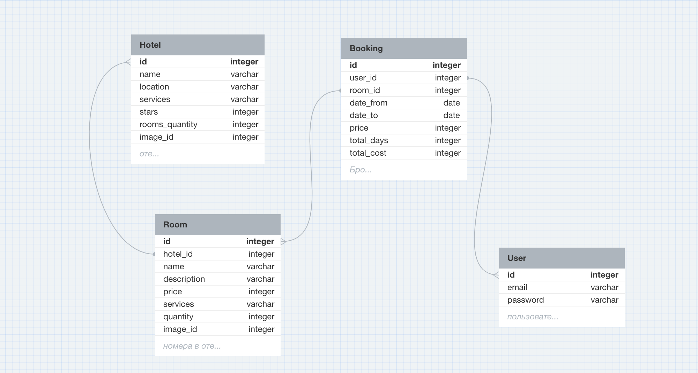

# Сервис по бронированию номеров в отелях, написанный на FastAPI

## Основной функционал:
- Регистрация и аутентификация
- Создание номеров/отелей с помощью json файлов
- Бронирование номеров(с проверкой на даты и наличие свободных номеров)
- Просмотр номеров текущего пользователя
- Отправка email с подтверждением бронирования(celery task)
- Небольшой фронтенд(bootstrap)
- Новостной раздел на сайте, работающий с ElasticSearch + Kibana
- Админка
- Сборка метрик с помощью prometheus и визуализация их в Grafana
- Flower для визуализации отложенных задач
- Настроено CI/CD, а точнее GitHub Actions на запуск тестов, линтера flake8 при push в репозиторий(используется кэш)
- Sentry для просмотра ошибок
- Миграции с помощью alemibic
- И многое по мелочи ...

## Установка:
- `git clone https://github.com/romaha57/fastAPI.git`
- `docker-compose up`

## Структрура БД
  

Примечание(для себя):
- в качестве гет параметров можно использовать класс как аргумент эндпоинта
- alembic init migrations
- в migrations/env добавили путь для импортов, импорты Base и моделей, добавили config.set_main_options, прописали target_metadata
- переместили alembic.ini в корень и поменяли путь в файле(script_location)
- alembic revision --autogenerate -m 'message' - создание миграций
- alembic upgrade head - применение миграций(alembic downgrade -1)
- celery -A app.tasks.settings_celery:celery flower запуск визуального интерфейса для отложенных задач
- celery -A app.tasks.settings_celery:celery worker --loglevel=INFO запуск воркера
